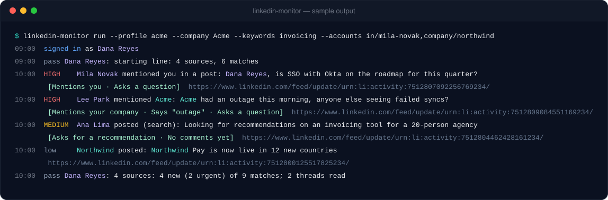
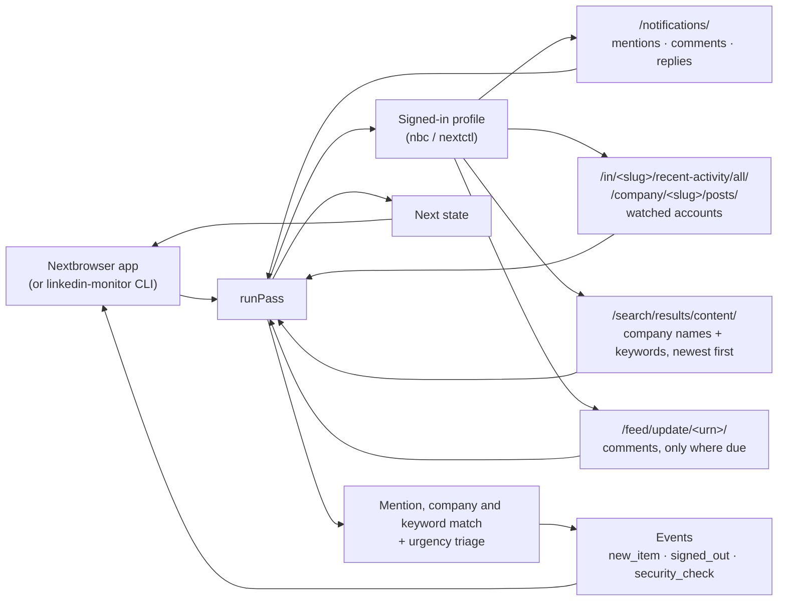

<p align="center">
  
</p>

<h1 align="center">Nextbrowser LinkedIn Monitoring</h1>

<p align="center">
  <strong>The open-source LinkedIn monitoring engine for Nextbrowser: mentions of you and your company, comments on your posts, replies to your comments, the posts of the people and companies you watch, and new posts that ask for what you sell — each with its author and post, ranked by how urgently it needs an answer, read from your own signed-in browser profile.</strong>
</p>

<p align="center">
  <a href="https://nextbrowser.com/">Website</a> ·
  <a href="https://github.com/nextbrowser-oss/nextbrowser-app">Nextbrowser app</a> ·
  <a href="https://docs.nextbrowser.com/">Product docs</a> ·
  <a href="docs/walkthrough.md">Walkthrough</a> ·
  <a href="docs/how-it-works.md">How it works</a> ·
  <a href="https://discord.com/invite/gHXEvkGXnz">Discord</a>
</p>

<p align="center">
  <a href="https://github.com/nextbrowser-oss/nextbrowser-linkedin-monitoring/actions/workflows/ci.yml"></a>
  <a href="LICENSE"></a>
  
  
  <a href="https://github.com/nextbrowser-oss/nextbrowser-app"></a>
</p>

<p align="center">
  English ·
  <a href="docs/i18n/ru/README.md">Русский</a>
</p>

<p align="center">
  
</p>

## Why Nextbrowser LinkedIn Monitoring

This package is the engine behind LinkedIn monitoring in [Nextbrowser](https://github.com/nextbrowser-oss/nextbrowser-app). LinkedIn is where B2B buyers ask their network which vendor to pick, where customers complain about an outage in public, and where a competitor's announcement lands first — and it is closed to tools: what a member sees is shown only to a signed-in member, and LinkedIn's API gives none of it to a member's own software. The engine runs on a browser profile you have signed in to linkedin.com, and on every pass it answers four questions:

- who mentioned you, commented on your posts, or replied to your comments;
- which new posts name your company, a competitor, or a problem you solve — and which of them ask for a recommendation;
- what the people and companies you watch — key customers, prospects, competitors — just posted;
- which of all that needs an answer first.

It is open source because it works with your own account. Anyone can read exactly which pages it opens, what it reads from them, and how it decides what is urgent.

- **Read-only.** It never reacts, comments, replies, connects, messages or posts. It does not even click "…more": a post cut short is reported as cut short.
- **Context in every alert.** Each item carries its author (name, headline, profile link), its post (id, link, author, opening text), where it was found (notifications, a watched account, a search), and for a comment the post it is on and the comment it answers.
- **No duplicate alerts.** Every post and comment is remembered by its id, so an item found by a notification and by a search is one item, announced once, ever, across restarts.
- **Explainable triage.** Fixed rules rank every match *high*, *medium* or *low*, and each match carries the reasons in plain words. No model is involved and nothing leaves the machine.
- **Says what went wrong.** A signed-out profile, a security check, a restriction, LinkedIn's search limit, an account that is not there and a page LinkedIn would not draw are reported as what they are, not as "nothing new".

## From a mention to an approved reply

Monitoring is one half of the LinkedIn skill in Nextbrowser. The skill's panel switches between **Monitoring** and **Reply agent**:

| Step | Where | What happens |
| --- | --- | --- |
| 1. Detect mentions and content | this engine | Your notifications (mentions, comments on your posts, replies to your comments), the newest posts of up to 10 watched people and companies, LinkedIn's post search for your company names and keywords, and the comments under the posts that concern you. |
| 2. Triage by urgency | this engine | Each match is ranked: it mentions you, it replies to you, it names your company, it is on your post, it asks for a recommendation, it says an urgent term such as "outage" or "refund", it asks a question, nobody has answered yet, it is picking up fast. |
| 3. Draft a response | Nextbrowser's LinkedIn reply agent | *Draft reply* hands the match — with its author and post — to the connected agent, which opens the post in the same profile, reads the thread and writes an answer to that specific post or comment. |
| 4. Approve before publishing | Nextbrowser's LinkedIn reply agent | The draft is shown to you first. Nothing is posted until you approve it, and then only that reply. |

The engine stops at step 2 on purpose: whatever it finds, a person decides what gets said. The [walkthrough](docs/walkthrough.md) follows one post through all four steps.

## Key features

| Area | What is available |
| --- | --- |
| Notifications | Mentions of you, comments on your posts, replies to your comments. Reactions, views, birthdays, job alerts and the like are skipped: there is nothing to answer. A card is told apart by its link (a comment, a reply) in any language, and by its English wording after that. |
| Watched accounts | Up to 10 people (`/in/…`) or companies (`/company/…`): every new post is reported. A person's activity page is retried from their posts tab when LinkedIn draws nothing. |
| Search | LinkedIn's post search, newest first, for your company names and keywords, grouped into at most 2 queries per pass (3 at most), every result matched again locally. |
| Company mentions | Your company's names are always searched and matched; a post or a comment that names one ranks *high*. |
| Leads | "Looking for…", "alternative to…", "who do you use for…": a request for a recommendation is its own triage rule. |
| Comments | Under your own posts, under posts that mention you or name your company or a keyword, and under the watched accounts' posts — read only when the post's comment count grew or a new notification points at it, a few posts per pass. |
| Urgency triage | *high*, *medium* or *low*, with the reasons, from rules you can read in [`src/triage.ts`](src/triage.ts). Urgent terms count only in items about you. |
| Links and context | Every item links straight to the post (`/feed/update/urn:li:activity:<id>/`) or the comment (`?commentUrn=`), and carries its author's headline and the post it belongs to. |
| Exact times | A LinkedIn id carries the moment it was made, so freshness never depends on a drawn "3h". |
| Persistent state | One JSON document: each source's starting line, seen items, per-post comment counts, the account. Nothing is announced twice across restarts. |
| Degraded states | Signed out, security check, restriction (including HTTP 999), search limit, account not found, nothing drawn, a post that would not open, no network: each one a clear note and a summary flag. |
| Embeddable core | `runPass(state) → { state, events, summary, matches }`, with no Node dependency, so it runs in the Nextbrowser renderer. |
| Standalone CLI | `linkedin-monitor` drives any Nextbrowser profile through `nbc`/`nextctl`. |

## Setup

### In Nextbrowser

1. Open **Skills → LinkedIn → Monitoring**.
2. Choose a browser profile and press **Open linkedin.com**. Sign in there yourself; the panel shows `Dana Reyes · Signed in`.
3. Add your company's names, a few keywords (products, competitors, the problem you solve), words to skip, and up to 10 people or companies to watch.
4. Leave the interval at 60 minutes — 30 is the minimum — and press **Start**.

The first pass draws each source's starting line and announces nothing; from the second pass on, the panel lists what needs a look, most urgent first, with the author and the post beside each match and *Draft reply* on every one.

Use a profile with its own steady proxy in the account's usual country, and an account that already uses LinkedIn like a person does. LinkedIn restricts accounts that load pages like a script; keep the pacing as it is.

### In code

Nextbrowser ships the engine as a dependency and gives it the browser, a place to keep the state, and a timer:

```ts
import { normalizeState, runPass, scheduleDelay, withSettings } from "@nextbrowser-oss/linkedin-monitoring";

const saved = withSettings(normalizeState(await load()), {
  companyNames: ["Acme"],
  keywords: ["invoicing", "accounts payable"],
  accounts: ["https://www.linkedin.com/in/mila-novak/", "https://www.linkedin.com/company/northwind/"],
});
const { state, events, summary, matches } = await runPass({
  browser: cliBrowser(profileArgs),          // the app's nextctl-backed browser for the profile
  state: saved,
  onEvent: (event) => notify(event),         // new_item, signed_out, security_check, ...
});
await save(state);
show(matches);                               // most urgent first, with the reasons, author and post
const backOff = !!summary.blocked || summary.rateLimited || summary.securityCheck || summary.loginRequired;
setTimeout(next, scheduleDelay(60 * 60_000, { backOff }));
```

The [integration guide](docs/integration.md) describes the contract between the app and the engine.

### Standalone

You need Node.js 22 or later and a Nextbrowser profile signed in to linkedin.com. The CLI uses the `nextctl` binary managed by the app, or `nbc` from your `PATH`.

```bash
git clone https://github.com/nextbrowser-oss/nextbrowser-linkedin-monitoring.git
cd nextbrowser-linkedin-monitoring
npm ci
npm run build
node dist/node/bin.js run --profile <your-profile> --company "<Your company>" --keywords "<product>,<competitor>" --accounts <profile-or-company-link>
```

What to expect:

1. The first pass records the newest notifications, posts and search results as each source's starting line and announces nothing.
2. Each later pass prints new matches, most urgent marked `HIGH`, with the reasons and a direct link, then waits about an hour (`--interval`).
3. Stop it with <kbd>Ctrl</kbd>+<kbd>C</kbd>. The next run continues from the saved state in `~/.nextbrowser/linkedin-monitoring/<profile>.json`.

Piped to another program, the output switches to JSON lines, one event per line. The [CLI reference](docs/cli-reference.md) lists every flag.

## Configuration

| Setting | Default | Meaning |
| --- | --- | --- |
| `accounts` | `[]` | Up to 10 people or companies: links, `in/<slug>`, `company/<slug>`. |
| `companyNames` | `[]` | Up to 5 names of your own company: always searched, and a mention ranks high. |
| `keywords` | `[]` | Up to 20 words or phrases: products, competitors, the problem you solve. |
| `excludeKeywords` | `[]` | Words that drop an item even when a keyword matched. |
| `urgentTerms` | a built-in list | Terms that make an item urgent. |
| `watchNotifications` | `true` | Read your notifications. |
| `watchComments` | `true` | Read the comments on posts that concern you when their count grew or a notification points at them. |
| `searchKeywords` | `true` | Search LinkedIn's posts for the company names and keywords. |
| `maxSearches` | `2` | Searches per pass (0–3). |
| `maxScrolls` | `2` | Scrolls per page to get back to what the last pass saw (0–4). |
| `maxCommentReads` | `4` | Posts one pass may open for their comments (0–8); the rest wait for the next pass. |
| `maxItemAgeMs` | 72 h | Older items are not announced. |
| `parkTab` | `true` | Leave the tab on `about:blank` after a pass. |

[Events and state](docs/events-and-state.md) describes every setting, event and field of the state document.

## How it works



Every pass, in order: it opens the notifications, waits until LinkedIn has drawn them, and reads who is signed in; reads each watched account's newest posts, falling back to a person's posts tab when nothing was drawn; runs the searches; opens the posts whose comments are due, the account's own first; and parks the tab. Between pages it pauses six to fourteen seconds. The [how it works](docs/how-it-works.md) page explains every rule.

## Documentation

- [Walkthrough](docs/walkthrough.md): one post from detection to an approved reply, step by step.
- [How it works](docs/how-it-works.md): the pass, reading the page, freshness from ids, notifications, search, comments, triage, degraded states, pacing.
- [Integration guide](docs/integration.md): the contract with the Nextbrowser app, the Node adapter, installing the package.
- [Events and state](docs/events-and-state.md): every event, the state document, and the settings.
- [CLI reference](docs/cli-reference.md): `linkedin-monitor` commands, flags, output, and exit codes.
- [Troubleshooting](docs/troubleshooting.md): signed out, security checks, restrictions, the search limit, accounts that will not draw, missing posts and comments.

## Project status

This is an early release (`0.x`). Known limits:

- **Not yet verified live.** Nothing here has been run against a live signed-in LinkedIn session. The page scripts are tested against trimmed documents that follow the structure LinkedIn is known to draw, and the first live run will likely need fixes.
- **LinkedIn's markup changes.** The scripts lean on what survives releases: the URNs LinkedIn writes into its own markup (`data-urn`, `data-id`, `data-chameleon-result-urn`), link shapes (`/feed/update/<urn>/`, `?commentUrn=`, `/in/`, `/company/`), aria labels and roles. Where a class name is the only hook there is — `feed-shared-update-v2` and `update-components-actor` (a post and its author), `update-components-text` (its text), `update-components-header` (a repost), `nt-card` (a notification), `comments-comment-entity` / `comments-comment-item` (a comment), `global-nav__me-photo` (who is signed in) — it is used with a fallback, and the list is in [`src/scripts.ts`](src/scripts.ts). When LinkedIn changes them, a read comes back empty, and the pass says so rather than going quiet.
- **English UI preferred.** The sign-in, security-check, restriction, search-limit and not-found screens, and the verbs on notification cards ("mentioned you", "commented on your post"), are recognized by their English wording. Posts and comments are read in any language, and a notification's link still tells a comment or a reply apart; the rest is reported less precisely in other languages.
- **Who is signed in, by name.** LinkedIn's session cookie is out of a script's reach, so the account is known by the name on its photo in the nav and, on the feed, by its public id. Two people with the same name as the account are told apart only where a profile link is drawn.
- **Comments as drawn.** A post's page shows a selection of its comments ("Most relevant"), not necessarily all of the newest.
- **Search is limited for free accounts.** LinkedIn caps searches with its "commercial use limit"; when it is reached the searches are skipped and the other sources are read as usual.

Proposals and bugs go to [GitHub Issues](https://github.com/nextbrowser-oss/nextbrowser-linkedin-monitoring/issues). An issue is a proposal, not a release commitment.

## Contributing

Read [CONTRIBUTING.md](CONTRIBUTING.md) before opening a change. Keep changes focused. For any change to what is read from linkedin.com, or to how a match is ranked, include tests. A README change must also update the [Russian edition](docs/i18n/ru/README.md).

## Community and support

- Join the [Nextbrowser Discord](https://discord.com/invite/gHXEvkGXnz) for community chat, setup help, and product updates.
- Ask general questions in [Nextbrowser Discussions](https://github.com/nextbrowser-oss/nextbrowser-app/discussions).
- Use [GitHub Issues](https://github.com/nextbrowser-oss/nextbrowser-linkedin-monitoring/issues) for actionable, scoped work.
- Follow [SECURITY.md](SECURITY.md) for private vulnerability reporting. Do not publish security details in an issue.

## Responsible use

Monitor only with an account you operate, and watch only what that account may see. [LinkedIn's User Agreement](https://www.linkedin.com/legal/user-agreement) prohibits scraping and automated access: reading through your own browser profile is still automated access, and it is yours to make sure you have the right to it. This engine reads only what the signed-in member can see, at a person's pace, for the purpose of answering people — never at scale, never to build lists of members or their data. Do not copy members' posts or profiles elsewhere.

The monitor paces itself on purpose:

- at least thirty minutes between passes, sixty by default, and three intervals after a sign-out, a security check or a restriction;
- a pause of six to fourteen seconds before every page, and a few seconds between scrolls;
- at most 10 watched accounts, 3 searches, 4 scrolls per page and 8 posts opened for comments per pass;
- the tab is parked on `about:blank` between passes.

Do not remove these limits to scrape at scale. Do not use what it finds to send unsolicited or repetitive replies or messages: LinkedIn restricts accounts for it, and the people on the other end notice.

## License

Nextbrowser LinkedIn Monitoring is open-source software available under the [GNU Affero General Public License v3.0 only](LICENSE).

AGPL-3.0 permits commercial use, modification, and redistribution. If you distribute a modified version or run it as a network service, the license requires you to offer the corresponding source code under the same license. This repository's dependencies remain under their respective licenses.

Copyright © 2026 Nextbrowser contributors.
