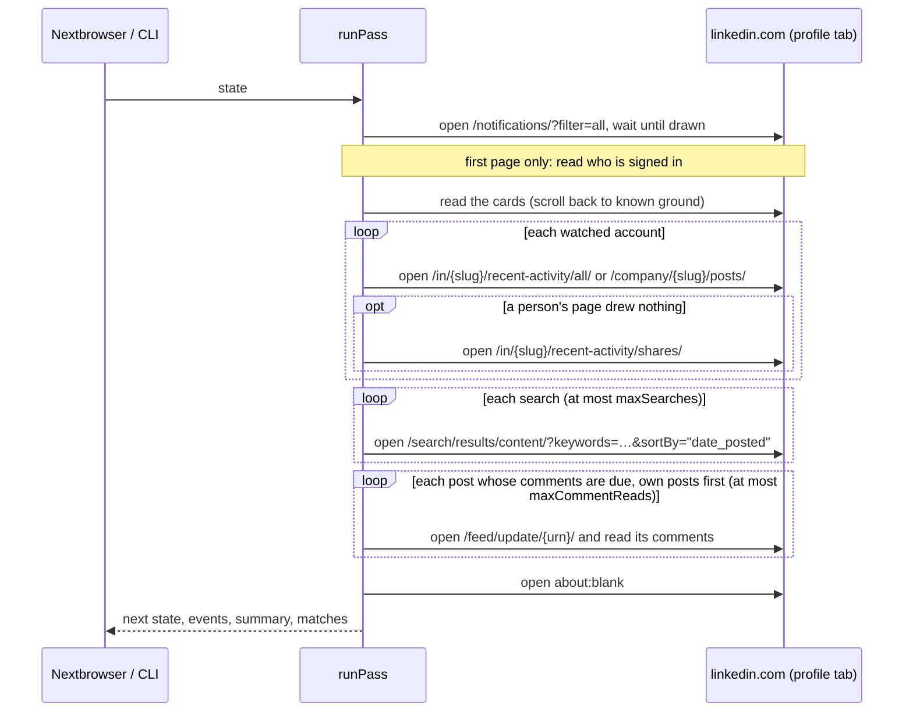

# How it works

A **pass** is one look at LinkedIn through a Nextbrowser profile that is signed in to linkedin.com. It takes the saved state in and returns the next state, the events, a summary, and the matches it found. It never changes the state it was given: a pass that is stopped or fails halfway leaves the last saved state intact, and a pass that finishes returns everything it learned. When the next pass runs is up to the caller.



## Reading linkedin.com

What a member sees on LinkedIn is shown only to a signed-in member, and the data LinkedIn's own app loads it from is signed per session and changes without notice; LinkedIn's API gives none of it to a member's own tools. So the monitor reads what the member sees: it opens a page in the profile's tab, waits until LinkedIn has drawn it, and reads it out of the page.

The page scripts ([`src/scripts.ts`](../src/scripts.ts)) lean first on what survives LinkedIn's releases, and on a class name only where nothing else exists — always with a fallback:

| What | How it is found |
| --- | --- |
| A post | an element whose `data-urn` is `urn:li:activity:…`, `urn:li:share:…` or `urn:li:ugcPost:…`; on a search page, its container's `data-chameleon-result-urn`. Comments and reshared posts nested in it are not the post. |
| Its id and link | the URN; the link is rebuilt as `/feed/update/<urn>/` |
| Its author | the `update-components-actor` block (class): the first link to `/in/<slug>` or `/company/<slug>`, the name in its title, the headline under it. The screen-reader copy of each (`visually-hidden`) is skipped so nothing is read twice. Without the block, the first profile link in the post. |
| Its text | `update-components-text` (class), with `feed-shared-update-v2__description` and the longest `[dir="ltr"]` span as fallbacks; buttons inside it are skipped |
| "…more" | a button labelled "…more" / "see more": the post is reported as `truncated`, never expanded |
| Tags | links to `/in/` and `/company/` inside the text |
| Counts | buttons and spans labelled "23 comments", "4 reposts", "1,234 reactions", or "Mila Novak and 41 others" |
| A repost | the `update-components-header` line "Mila Novak reposted this", or a reshared post nested inside |
| Its time | the drawn label ("3h • Edited •") — but see below: the id is what counts |
| A notification | an `nt-card` (class), falling back to the articles of the main column: the link it points at (a post, `?commentUrn=`, `&replyUrn=`), the person it names, its words, its time |
| A comment | an element whose `data-id` is `urn:li:comment:(activity:<post>,<id>)` (`comments-comment-entity` / `comments-comment-item` as fallbacks); a reply is a comment nested in another |
| Who is signed in | the alt text of the member's photo in the global nav (`global-nav__me-photo`), and on the feed the identity card's link to `/in/<slug>` |

Every value from outside the page is inserted into a script as a JSON literal, and every read is cut down in the page to the fields the monitor uses. Nothing is clicked, typed or submitted.

### Waiting for the page

The load event fires long before LinkedIn draws anything. After it, the page is polled every half second, for up to 20 seconds (12 for a post's comments), until what it was opened for is drawn, until the page turns out to be one of the screens in front of it (sign-in, security check, restriction, search limit, not found), or until LinkedIn says there is nothing ("No results found", "hasn't posted lately") — each of which ends the wait just as well. Then the page's health is read: what it shows, and why.

### Scrolling

Notifications, an account's activity and a search are all drawn newest first. A read takes what is drawn and scrolls by part of a viewport — a slightly different part each time, as a reader would — up to `maxScrolls` times (2), until it has passed three items the last pass saw, or the bottom item is older than the source's starting line. Two scrolls in a row that bring nothing end the read too. A source's first read does not scroll: it announces nothing, so there is nothing to look for further down.

### The posts-tab fallback

A person's recent activity (`/in/<slug>/recent-activity/all/`) is a heavy, lazy page that sometimes draws nothing at all. When it does — no post and no "hasn't posted" notice — the pass opens the person's posts tab (`/recent-activity/shares/`) once, which holds only their own posts and draws more reliably. When that draws nothing either, the account is noted as unreadable for this pass — not a failed pass: the other sources are read as usual, and the account's starting line and seen posts are kept. A company's posts page has no such fallback.

## What counts as new

The first time a source is read — the notifications, an account, a search query — what it holds is its **starting line**: the pass records the time and every id, and announces nothing. From then on an item is new when its id was not seen before by any source (the state keeps the last 5,000 keys) and it was created after the starting line.

A LinkedIn id says when it was created. Like the ids of most large sites, its first 41 bits are milliseconds since the Unix epoch: `BigInt(id) >> 22n` is the moment the post, the comment or the reply was made. So a post's freshness never depends on the "3h" or "1w" LinkedIn draws, and a featured post pinned above the new ones is recognized as old:

- an item created before the starting line is never new, wherever it sits on the page;
- an item older than `maxItemAgeMs` (72 hours) is not announced.

A plain repost is dated by the original post: a repost of something old is not news. For an item whose id carries no time, the pass falls back to the Facebook monitor's rules: a drawn time read as a range ("3h" is at least three hours and less than four), and otherwise the item's position — above a post the last pass saw, or on a notification card it never saw.

When a read never gets back to known ground — the account was very busy, or the scroll limit was too low — the summary says so. New items are emitted as `new_item` events, oldest first within each source; notifications are emitted after the posts they point at have been read, so they carry them.

A source removed from the settings is forgotten, with the posts found in it, so adding it back starts over. A search whose terms change is a new source.

## Notifications

The notifications page shows everything LinkedIn tells the member, most of which needs no answer. A card is kept when it points at a post and is about the account:

| The card | How it is told | What is reported |
| --- | --- | --- |
| A reply to your comment | its link carries `&replyUrn=`, or it says "replied to your comment" | the reply, addressed `reply` |
| A mention | it says "mentioned you" or "tagged you" | the comment it links (`?commentUrn=`), or the post, addressed `mention` |
| A comment on your post | it says "commented on your post" | the comment it links, addressed `comment_on_post`; with no comment linked ("… and 3 others commented"), nothing itself — the post's comments are read instead |
| A reaction, a view, a birthday, a job, a repost, a follow | its words | nothing |
| Anything else that links a post or a comment | its link | the item, only if it names you, your company or a keyword |

Every card the pass has not seen before also makes the post it points at due for a comment read: an aggregated card counts several comments and links one. A card is keyed by what it links and says, so a card LinkedIn rewrites in place ("Bo Chen and 4 others commented") is new again.

The verbs are English. In another language, a card still tells a comment and a reply apart by its link, and its words still match your name, your company and your keywords.

## Search

LinkedIn's post search (`/search/results/content/?keywords=…&sortBy="date_posted"`), newest first, is where a stranger asks which vendor to use or complains about one. The terms are your `companyNames`, always first, then your `keywords`; they are grouped into at most `maxSearches` queries (2) of up to six terms each, joined with `OR` and phrases quoted:

```text
Acme OR invoicing OR "accounts payable"
```

LinkedIn's search stems and fuzzes, so every result is matched again here, exactly as everything else is: a result that does not name a company name, a keyword or the account is dropped. A term that does not fit into `maxSearches` queries is not searched, and the summary says so; it is still matched in everything else the pass reads.

LinkedIn limits search for free accounts. When a search page says the "commercial use limit" is reached, the pass sets `searchLimited`, skips the remaining searches, and goes on with the comments — it is not a restriction of the account.

## What is reported

- **From the notifications:** mentions, replies to your comments, comments on your posts, and anything else that names you, your company or a keyword.
- **From a watched account:** every new post. With keywords or company names, the ones that name one get the matching reasons.
- **From a search:** every new post that names your company, a keyword, or the account.
- **From a post's comments:** every comment that mentions the account, replies to the account's comment, is on the account's own post, or names your company or a keyword.

Matching works the same everywhere:

- **A mention** is a tag that links to the account's profile, a tag drawn with the account's name, or the account's full name in plain text. A first name alone is not a mention.
- **A company mention** is one of your `companyNames` in the text, or a tag of a company by that name.
- **Keywords** are matched as whole words or phrases, case-insensitively, in any script. A hashtag counts as a word: `acme` is found in `#acme` and in `Acme's`, not in `acmeshop`.
- **Exclusion words** drop an item even when a keyword matched, unless it is addressed to the account.
- **The account's own posts and comments** are never reported; the comments on its posts are.

Every item carries its author (`author`, `authorHeadline`, `authorUrl`), its post (`id`, `urn`, `url`, `author`, the text's opening), where it was found, and a direct link: the post (`https://www.linkedin.com/feed/update/<urn>/`) or the comment (the post's link with `?commentUrn=`, and `&replyUrn=` for a reply).

## Comments

Opening a post is a page load of its own, so comments are read sparingly. A post's comments are read when:

- a notification the pass has not seen points at it (its own posts first);
- or it was read from a page with a drawn comment count, it concerns the account — the account's own post, a post that mentions it or names your company or a keyword — or it is a watched account's post, and its count grew since the last look.

A post seen for the first time is only recorded; its comments are part of the starting line — unless the post itself is new, and then its comments are all new too. A pass opens at most `maxCommentReads` posts (4), the account's own first, then posts about the account, then the watched accounts' posts. A post past that is marked due (`state.posts[id].due`), so the next pass opens it — nothing is skipped, only delayed — and the summary says how many wait.

On the post's page, the post itself and its comments and replies are read. A comment's id, like a post's, carries its time, so a comment is new when it was created after the starting line of the source that surfaced the post. A post whose page will not open is dropped from the watch list (it was deleted); a read that fails keeps the post due and its count as it was, and the next pass tries again.

## Triage

Every match is ranked by fixed rules ([`src/triage.ts`](../src/triage.ts)). Each adds points and a reason in plain words:

| Rule | Points | Reason shown |
| --- | --- | --- |
| Mentions the account | +4 | "Mentions you" |
| Replies to the account's comment | +4 | "Replies to your comment" |
| Names your company | +3 | "Mentions your company" |
| A comment on the account's own post | +2 | "Comments on your post" |
| Asks for a recommendation: "recommend", "looking for", "alternative to", "any suggestions", "who do you use", "does anyone use" | +2 | "Asks for a recommendation" |
| Says an urgent term (`urgentTerms`: "outage", "refund", "not working"…), in an item that is addressed to the account, names your company, or names a keyword | +3 | `Says "outage"` |
| Asks a question: a question mark, or text that starts with a question word | +1 | "Asks a question" |
| A lead, or a post about you, that nobody has commented on yet | +1 | "No comments yet" |
| A post that gained 30 or more comments since the last look | +1 | "35 comments since the last look" |

Four points or more is **high**, two or three is **medium**, anything else is **low**. On LinkedIn a request for a recommendation is how a B2B lead looks, so it weighs more than it does in the other monitors — but on its own it is still *medium*: a person decides whether to answer a stranger. No model is involved, and nothing is sent anywhere.

## Degraded states

| What the page shows | What the pass does |
| --- | --- |
| The sign-in wall: `/authwall`, `/login`, `/uas/login`, `/signup`, the sign-in pages under `/checkpoint/lg/`, a sign-in form, or a page drawn for a visitor | Emits `signed_out` once, sets `loginRequired`, and stops: nothing can be read signed out. |
| A security check: anything else under `/checkpoint/`, or "Let's do a quick security check" | Emits `security_check`, sets `securityCheck`, and stops. Someone has to complete it in the profile. |
| A restriction: "You've reached the weekly limit", "temporarily restricted", "unusual activity from your account", or HTTP 999 | Sets `rateLimited` and `blocked` with LinkedIn's words, and stops. |
| The search limit: "commercial use limit" on a search page | Sets `searchLimited`, notes it, skips the remaining searches, and goes on. |
| A profile or company that is not there, or not visible to the account | Notes it and goes on with the next source. |
| A person's activity page that draws nothing | Reads their posts tab. |
| Nothing drawn on either | Notes the account as unreadable this pass and goes on. |
| A post's page that fails | Notes it; the post stays due and is opened again next pass. |
| Chromium's error page, or a browser that cannot open the page | Sets `blocked` with the error, and stops. |

After a stop, the caller backs off: `scheduleDelay(interval, { backOff: true })` waits three intervals. A pass that stops keeps everything it read before the stop — notifications it read are still announced — and every source it did not reach keeps its old state.

A restriction and a sign-in wall are recognized only in what LinkedIn says about the session — a dialog, a banner, a heading — or anywhere on a page with no posts, so a post that happens to say "unusual activity" never stops a pass.

## Pacing

LinkedIn restricts accounts that load pages like a script, and every read here is a page load. The pass is slow on purpose:

- at least 30 minutes between passes, 60 by default, with a ±20% spread;
- a pause of 6 to 14 seconds before every page after the first, and 1.5 to 4 seconds after every scroll;
- at most 10 watched accounts, 3 searches, 4 scrolls per page, 8 posts opened for comments per pass — 2 searches, 2 scrolls and 4 posts by default;
- the tab is parked on `about:blank` after the pass (`parkTab`), so nothing is left polling linkedin.com between passes.

A default pass with notifications, two watched accounts and one search opens four pages, plus one for each post whose comments are due (four at most) and one for each person whose activity page needed the fallback, and takes one to three minutes.

## What it never does

The engine only reads. It never reacts, comments, replies, reposts, connects, follows, sends a message or posts, and it never clicks — not even "…more". It keeps no network connections, timers, or files of its own: everything goes through the browser and the state it is handed.
