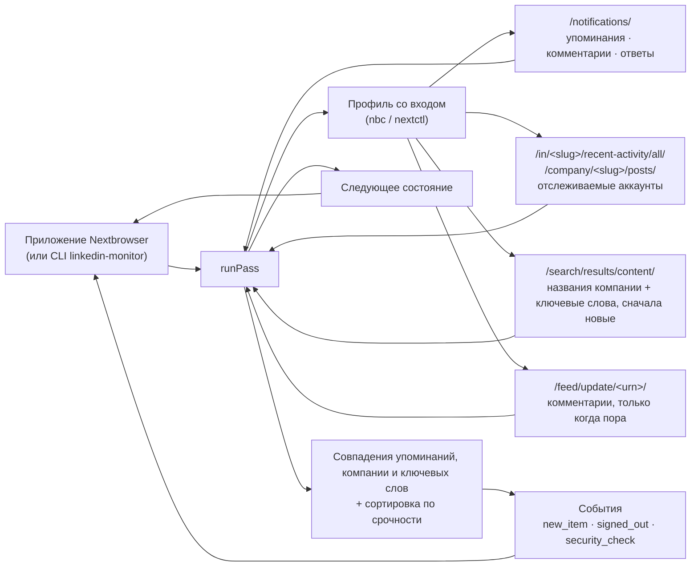

<p align="center">
  
</p>

<h1 align="center">Nextbrowser LinkedIn Monitoring</h1>

<p align="center">
  <strong>Открытый движок мониторинга LinkedIn для Nextbrowser: упоминания вас и вашей компании, комментарии к вашим постам, ответы на ваши комментарии, посты людей и компаний, за которыми вы следите, и новые посты, где спрашивают то, что вы продаёте, — каждый с автором и постом, отсортированные по тому, насколько срочно нужен ответ, — прямо из вашего браузерного профиля, в котором выполнен вход.</strong>
</p>

<p align="center">
  <a href="https://nextbrowser.com/">Сайт</a> ·
  <a href="https://github.com/nextbrowser-oss/nextbrowser-app">Приложение Nextbrowser</a> ·
  <a href="https://docs.nextbrowser.com/">Документация продукта</a> ·
  <a href="../../walkthrough.md">Пошаговый пример</a> ·
  <a href="../../how-it-works.md">Как это работает</a> ·
  <a href="https://discord.com/invite/gHXEvkGXnz">Discord</a>
</p>

<p align="center">
  <a href="https://github.com/nextbrowser-oss/nextbrowser-linkedin-monitoring/actions/workflows/ci.yml"></a>
  <a href="../../../LICENSE"></a>
  
  
  <a href="https://github.com/nextbrowser-oss/nextbrowser-app"></a>
</p>

<p align="center">
  <a href="../../../README.md">English</a> ·
  Русский
</p>

<p align="center">
  
</p>

## Зачем нужен Nextbrowser LinkedIn Monitoring

Этот пакет — движок, на котором работает мониторинг LinkedIn в [Nextbrowser](https://github.com/nextbrowser-oss/nextbrowser-app). LinkedIn — это место, где B2B-покупатели спрашивают свою сеть, какого поставщика выбрать, где клиенты публично жалуются на сбой и где первым появляется анонс конкурента. И он закрыт для инструментов: то, что видит участник, показывают только участнику, который вошёл в аккаунт, а API LinkedIn ничего из этого не отдаёт собственным программам участника. Движок работает в браузерном профиле, где вы вошли в linkedin.com, и за каждый проход отвечает на четыре вопроса:

- кто упомянул вас, прокомментировал ваши посты или ответил на ваши комментарии;
- какие новые посты называют вашу компанию, конкурента или задачу, которую вы решаете, — и в каких из них просят рекомендацию;
- что только что опубликовали люди и компании, за которыми вы следите, — ключевые клиенты, потенциальные клиенты, конкуренты;
- что из всего этого требует ответа в первую очередь.

Он открыт, потому что работает с вашим собственным аккаунтом. Любой может прочитать, какие страницы он открывает, что с них читает и как решает, что срочно.

- **Только чтение.** Он никогда не ставит реакции, не комментирует, не отвечает, не добавляет в контакты, не пишет сообщения и не публикует. Он не нажимает даже «…ещё»: обрезанный пост так и помечается как обрезанный.
- **Контекст в каждом оповещении.** У каждого элемента есть автор (имя, заголовок профиля, ссылка), пост (id, ссылка, автор, начало текста), место, где он найден (уведомления, отслеживаемый аккаунт, поиск), а у комментария — пост, к которому он относится, и комментарий, на который он отвечает.
- **Без повторных оповещений.** Каждый пост и комментарий запоминается по id, поэтому элемент, найденный и через уведомление, и через поиск, — это один элемент, о котором сообщат один раз, навсегда, даже после перезапуска.
- **Объяснимая сортировка.** Фиксированные правила присваивают каждому совпадению уровень *high*, *medium* или *low*, и у каждого совпадения есть причины простыми словами. Модель не используется, и ничего не уходит с компьютера.
- **Говорит, что пошло не так.** Профиль без входа, проверка безопасности, ограничение аккаунта, лимит поиска LinkedIn, несуществующий аккаунт и страница, которую LinkedIn не отрисовал, сообщаются как есть, а не как «ничего нового».

## От упоминания до одобренного ответа

Мониторинг — одна из двух половин навыка LinkedIn в Nextbrowser. Панель навыка переключается между **Monitoring** и **Reply agent**:

| Шаг | Где | Что происходит |
| --- | --- | --- |
| 1. Найти упоминания и контент | этот движок | Ваши уведомления (упоминания, комментарии к вашим постам, ответы на ваши комментарии), новейшие посты до 10 отслеживаемых людей и компаний, поиск LinkedIn по постам с названиями вашей компании и ключевыми словами, и комментарии под постами, которые касаются вас. |
| 2. Отсортировать по срочности | этот движок | Каждому совпадению присваивается уровень: упоминает вас, отвечает вам, называет вашу компанию, это комментарий к вашему посту, просит рекомендацию, содержит срочный термин вроде «outage» или «refund», задаёт вопрос, никто ещё не ответил, быстро набирает комментарии. |
| 3. Подготовить ответ | агент ответов LinkedIn в Nextbrowser | *Draft reply* передаёт совпадение — с автором и постом — подключённому агенту, который открывает пост в том же профиле, читает обсуждение и пишет ответ именно на этот пост или комментарий. |
| 4. Одобрить перед публикацией | агент ответов LinkedIn в Nextbrowser | Черновик сначала показывают вам. Ничего не публикуется, пока вы его не одобрите, и тогда публикуется только этот ответ. |

Движок намеренно останавливается на шаге 2: что бы он ни нашёл, что сказать, решает человек. [Пошаговый пример](../../walkthrough.md) проводит один пост через все четыре шага.

## Ключевые возможности

| Область | Что доступно |
| --- | --- |
| Уведомления | Упоминания вас, комментарии к вашим постам, ответы на ваши комментарии. Реакции, просмотры, дни рождения, вакансии и подобное пропускаются: на них нечего отвечать. Карточка распознаётся по ссылке (комментарий, ответ) на любом языке, а затем по английским формулировкам. |
| Отслеживаемые аккаунты | До 10 людей (`/in/…`) или компаний (`/company/…`): сообщается о каждом новом посте. Если страница активности человека ничего не отрисовала, читается его вкладка постов. |
| Поиск | Поиск LinkedIn по постам, сначала новые, по названиям вашей компании и ключевым словам, сгруппированным не более чем в 2 запроса за проход (максимум 3); каждый результат заново проверяется локально. |
| Упоминания компании | Названия вашей компании всегда ищутся и проверяются; пост или комментарий, который называет одно из них, получает уровень *high*. |
| Лиды | «Looking for…», «alternative to…», «who do you use for…»: просьба о рекомендации — отдельное правило сортировки. |
| Комментарии | Под вашими постами, под постами, которые упоминают вас или называют вашу компанию или ключевое слово, и под постами отслеживаемых аккаунтов — читаются, только когда число комментариев выросло или на пост указывает новое уведомление, по несколько постов за проход. |
| Сортировка по срочности | *high*, *medium* или *low* с причинами, по правилам, которые можно прочитать в [`src/triage.ts`](../../../src/triage.ts). Срочные термины учитываются только в элементах, которые касаются вас. |
| Ссылки и контекст | Каждый элемент ведёт прямо на пост (`/feed/update/urn:li:activity:<id>/`) или комментарий (`?commentUrn=`) и содержит заголовок профиля автора и пост, к которому относится. |
| Точное время | id LinkedIn содержит момент создания, поэтому свежесть никогда не зависит от нарисованного «3h». |
| Сохраняемое состояние | Один JSON-документ: стартовая черта каждого источника, просмотренные элементы, число комментариев каждого поста, аккаунт. Ничто не объявляется дважды, даже после перезапуска. |
| Деградированные состояния | Нет входа, проверка безопасности, ограничение (включая HTTP 999), лимит поиска, аккаунт не найден, ничего не отрисовано, пост не открылся, нет сети: каждое — понятная заметка и флаг в сводке. |
| Встраиваемое ядро | `runPass(state) → { state, events, summary, matches }` без зависимости от Node, поэтому работает в renderer-процессе Nextbrowser. |
| Отдельный CLI | `linkedin-monitor` управляет любым профилем Nextbrowser через `nbc`/`nextctl`. |

## Настройка

### В Nextbrowser

1. Откройте **Skills → LinkedIn → Monitoring**.
2. Выберите браузерный профиль и нажмите **Open linkedin.com**. Войдите там сами; панель покажет `Dana Reyes · Signed in`.
3. Добавьте названия вашей компании, несколько ключевых слов (продукты, конкуренты, задача, которую вы решаете), слова для пропуска и до 10 людей или компаний для отслеживания.
4. Оставьте интервал 60 минут — минимум 30 — и нажмите **Start**.

Первый проход проводит стартовую черту каждого источника и ничего не объявляет; начиная со второго прохода панель показывает, что требует внимания, сначала самое срочное, с автором и постом рядом с каждым совпадением и кнопкой *Draft reply* на каждом.

Используйте профиль со своим постоянным прокси в обычной для аккаунта стране и аккаунт, который уже пользуется LinkedIn как человек. LinkedIn ограничивает аккаунты, которые загружают страницы как скрипт; оставьте темп как есть.

### В коде

Nextbrowser подключает движок как зависимость и даёт ему браузер, место для хранения состояния и таймер:

```ts
import { normalizeState, runPass, scheduleDelay, withSettings } from "@nextbrowser-oss/linkedin-monitoring";

const saved = withSettings(normalizeState(await load()), {
  companyNames: ["Acme"],
  keywords: ["invoicing", "accounts payable"],
  accounts: ["https://www.linkedin.com/in/mila-novak/", "https://www.linkedin.com/company/northwind/"],
});
const { state, events, summary, matches } = await runPass({
  browser: cliBrowser(profileArgs),          // браузер приложения на основе nextctl для профиля
  state: saved,
  onEvent: (event) => notify(event),         // new_item, signed_out, security_check, ...
});
await save(state);
show(matches);                               // сначала самое срочное, с причинами, автором и постом
const backOff = !!summary.blocked || summary.rateLimited || summary.securityCheck || summary.loginRequired;
setTimeout(next, scheduleDelay(60 * 60_000, { backOff }));
```

[Руководство по интеграции](../../integration.md) описывает контракт между приложением и движком.

### Отдельно

Нужны Node.js 22 или новее и профиль Nextbrowser, в котором выполнен вход в linkedin.com. CLI использует бинарный файл `nextctl`, которым управляет приложение, или `nbc` из `PATH`.

```bash
git clone https://github.com/nextbrowser-oss/nextbrowser-linkedin-monitoring.git
cd nextbrowser-linkedin-monitoring
npm ci
npm run build
node dist/node/bin.js run --profile <your-profile> --company "<Your company>" --keywords "<product>,<competitor>" --accounts <profile-or-company-link>
```

Чего ожидать:

1. Первый проход записывает новейшие уведомления, посты и результаты поиска как стартовую черту каждого источника и ничего не объявляет.
2. Каждый следующий проход печатает новые совпадения, самые срочные помечены `HIGH`, с причинами и прямой ссылкой, затем ждёт около часа (`--interval`).
3. Остановите его клавишами <kbd>Ctrl</kbd>+<kbd>C</kbd>. Следующий запуск продолжит с сохранённого состояния в `~/.nextbrowser/linkedin-monitoring/<profile>.json`.

Если вывод передаётся другой программе, он переключается на JSON-строки, по одному событию на строку. [Справочник CLI](../../cli-reference.md) перечисляет все флаги.

## Конфигурация

| Настройка | По умолчанию | Значение |
| --- | --- | --- |
| `accounts` | `[]` | До 10 людей или компаний: ссылки, `in/<slug>`, `company/<slug>`. |
| `companyNames` | `[]` | До 5 названий вашей компании: всегда ищутся, а упоминание получает высокий уровень. |
| `keywords` | `[]` | До 20 слов или фраз: продукты, конкуренты, задача, которую вы решаете. |
| `excludeKeywords` | `[]` | Слова, которые отбрасывают элемент, даже если ключевое слово совпало. |
| `urgentTerms` | встроенный список | Термины, которые делают элемент срочным. |
| `watchNotifications` | `true` | Читать ваши уведомления. |
| `watchComments` | `true` | Читать комментарии под постами, которые касаются вас, когда их число выросло или на них указывает уведомление. |
| `searchKeywords` | `true` | Искать в постах LinkedIn названия компании и ключевые слова. |
| `maxSearches` | `2` | Поисков за проход (0–3). |
| `maxScrolls` | `2` | Прокруток на страницу, чтобы вернуться к тому, что видел прошлый проход (0–4). |
| `maxCommentReads` | `4` | Сколько постов один проход может открыть ради комментариев (0–8); остальные ждут следующего прохода. |
| `maxItemAgeMs` | 72 ч | Более старые элементы не объявляются. |
| `parkTab` | `true` | Оставлять вкладку на `about:blank` после прохода. |

[События и состояние](../../events-and-state.md) описывает каждую настройку, событие и поле документа состояния.

## Как это работает



Каждый проход по порядку: открывает уведомления, ждёт, пока LinkedIn их отрисует, и читает, кто вошёл; читает новейшие посты каждого отслеживаемого аккаунта, переходя на вкладку постов человека, если ничего не отрисовано; выполняет поиски; открывает посты, комментарии которых пора прочитать, сначала собственные; и паркует вкладку. Между страницами он делает паузу от шести до четырнадцати секунд. Страница [Как это работает](../../how-it-works.md) объясняет каждое правило.

## Документация

- [Пошаговый пример](../../walkthrough.md): один пост от обнаружения до одобренного ответа, шаг за шагом.
- [Как это работает](../../how-it-works.md): проход, чтение страницы, свежесть по id, уведомления, поиск, комментарии, сортировка, деградированные состояния, темп.
- [Руководство по интеграции](../../integration.md): контракт с приложением Nextbrowser, адаптер для Node, установка пакета.
- [События и состояние](../../events-and-state.md): каждое событие, документ состояния и настройки.
- [Справочник CLI](../../cli-reference.md): команды `linkedin-monitor`, флаги, вывод и коды выхода.
- [Устранение неполадок](../../troubleshooting.md): нет входа, проверки безопасности, ограничения, лимит поиска, аккаунты, которые не отрисовываются, пропавшие посты и комментарии.

## Статус проекта

Это ранний выпуск (`0.x`). Известные ограничения:

- **Ещё не проверено вживую.** Ничего здесь не запускалось на живой сессии LinkedIn со входом. Скрипты страниц протестированы на урезанных документах, повторяющих известную структуру LinkedIn, и первый живой запуск, скорее всего, потребует исправлений.
- **Разметка LinkedIn меняется.** Скрипты опираются на то, что переживает релизы: URN, которые LinkedIn записывает в собственную разметку (`data-urn`, `data-id`, `data-chameleon-result-urn`), форму ссылок (`/feed/update/<urn>/`, `?commentUrn=`, `/in/`, `/company/`), aria-метки и роли. Там, где имя класса — единственная зацепка, — `feed-shared-update-v2` и `update-components-actor` (пост и его автор), `update-components-text` (его текст), `update-components-header` (репост), `nt-card` (уведомление), `comments-comment-entity` / `comments-comment-item` (комментарий), `global-nav__me-photo` (кто вошёл), — оно используется с запасным вариантом, а список есть в [`src/scripts.ts`](../../../src/scripts.ts). Когда LinkedIn их меняет, чтение возвращается пустым, и проход сообщает об этом, а не молчит.
- **Предпочтителен английский интерфейс.** Экраны входа, проверки безопасности, ограничения, лимита поиска и «не найдено», а также глаголы на карточках уведомлений («mentioned you», «commented on your post») распознаются по английским формулировкам. Посты и комментарии читаются на любом языке, и ссылка уведомления всё равно отличает комментарий и ответ; остальное на других языках сообщается менее точно.
- **Кто вошёл — по имени.** Cookie сессии LinkedIn недоступна скрипту, поэтому аккаунт известен по имени на его фото в навигации и, в ленте, по публичному id. Два человека с тем же именем, что у аккаунта, различаются только там, где отрисована ссылка на профиль.
- **Комментарии как отрисованы.** Страница поста показывает подборку комментариев («Most relevant»), не обязательно все самые новые.
- **Поиск ограничен для бесплатных аккаунтов.** LinkedIn ограничивает поиски своим «commercial use limit»; когда он достигнут, поиски пропускаются, а остальные источники читаются как обычно.

Предложения и ошибки — в [GitHub Issues](https://github.com/nextbrowser-oss/nextbrowser-linkedin-monitoring/issues). Issue — это предложение, а не обязательство выпустить.

## Участие в разработке

Прочитайте [CONTRIBUTING.md](../../../CONTRIBUTING.md), прежде чем предлагать изменение. Делайте изменения сфокусированными. Для любого изменения того, что читается с linkedin.com, или того, как ранжируется совпадение, добавьте тесты. Изменение README должно обновлять и эту русскую версию.

## Сообщество и поддержка

- Присоединяйтесь к [Discord Nextbrowser](https://discord.com/invite/gHXEvkGXnz): общение, помощь с настройкой и новости продукта.
- Задавайте общие вопросы в [Nextbrowser Discussions](https://github.com/nextbrowser-oss/nextbrowser-app/discussions).
- Используйте [GitHub Issues](https://github.com/nextbrowser-oss/nextbrowser-linkedin-monitoring/issues) для конкретной, ограниченной работы.
- Следуйте [SECURITY.md](../../../SECURITY.md) для приватного сообщения об уязвимостях. Не публикуйте детали уязвимостей в issue.

## Ответственное использование

Ведите мониторинг только с аккаунта, которым вы управляете, и следите только за тем, что этот аккаунт может видеть. [Пользовательское соглашение LinkedIn](https://www.linkedin.com/legal/user-agreement) запрещает скрейпинг и автоматизированный доступ: чтение через собственный браузерный профиль — всё равно автоматизированный доступ, и убедиться, что у вас есть на него право, — ваша задача. Этот движок читает только то, что видит участник, вошедший в аккаунт, в темпе человека, ради того чтобы отвечать людям, — никогда в больших масштабах и никогда для составления списков участников или их данных. Не копируйте посты и профили участников в другие места.

Монитор намеренно сдерживает темп:

- не меньше тридцати минут между проходами, шестьдесят по умолчанию, и три интервала после выхода из аккаунта, проверки безопасности или ограничения;
- пауза от шести до четырнадцати секунд перед каждой страницей и несколько секунд между прокрутками;
- не более 10 отслеживаемых аккаунтов, 3 поисков, 4 прокруток на страницу и 8 постов, открытых ради комментариев, за проход;
- между проходами вкладка паркуется на `about:blank`.

Не снимайте эти ограничения, чтобы собирать данные в больших масштабах. Не используйте найденное для непрошеных или однотипных ответов и сообщений: LinkedIn ограничивает за это аккаунты, а люди на другой стороне это замечают.

## Лицензия

Nextbrowser LinkedIn Monitoring — программное обеспечение с открытым исходным кодом под [GNU Affero General Public License v3.0 only](../../../LICENSE).

AGPL-3.0 разрешает коммерческое использование, изменение и распространение. Если вы распространяете изменённую версию или запускаете её как сетевой сервис, лицензия требует предоставить соответствующий исходный код под той же лицензией. Зависимости этого репозитория остаются под своими лицензиями.

Copyright © 2026 Nextbrowser contributors.
